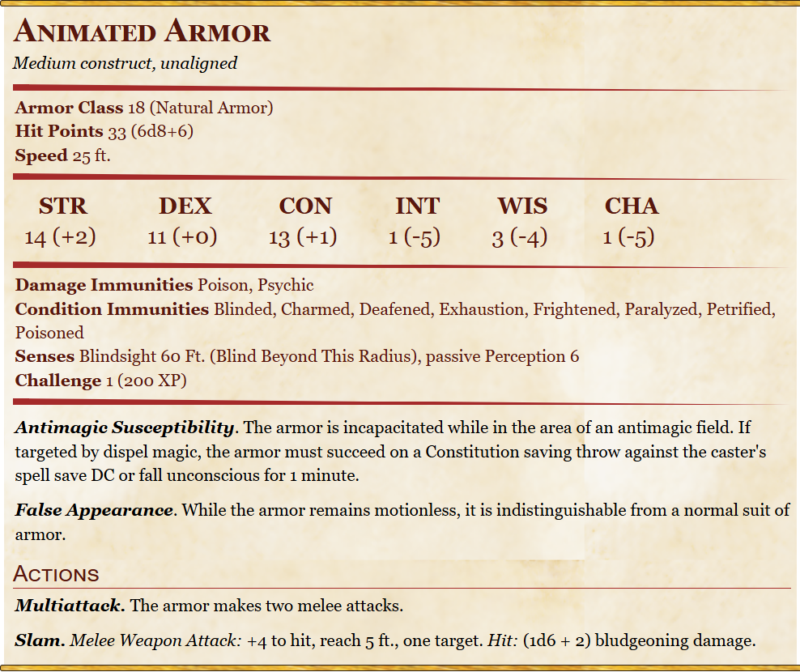

# Animated Armor

Medium construct, Unaligned

## Stats
- Armor Class: 18  (Natural Armor) 
- Hit Points: 33 (6d8+6)
- Speed: 25 ft.

- STR 14 (+2) 
- DEX 11 (+0) 
- CON 13 (+1) 
- INT 01 (-5) 
- WIS 03 (-4)
- CHA 01 (-5)

## Skills 

- Passive Perception 6
- Blindsight 60 Ft. (Blind Beyond This Radius)
- Challenge 1 (200 XP)

- Antimagic Susceptibility: The armor is incapacitated while in the area of an antimagic field. If targeted by dispel magic, the armor must succeed on a Constitution saving throw against the caster's spell save DC or fall unconscious for 1 minute.
- False Appearance. While the armor remains motionless, it is indistinguishable from a normal suit of armor.

### Immunities:
- Poisoned
- Psychic
- Poison
- Blinded
- Charmed
- Deafened
- Exhaustion
- Frightened
- Paralyzed
- Petrified

## Actions
- Multiattack. The armor makes two melee attacks.
- Slam. Melee Weapon Attack: +4 to hit, reach 5 ft., one target. Hit: (1d6 + 2) bludgeoning damage.

## Mentions
[Salsvault](../Locations/Salsvault.md) (S3)