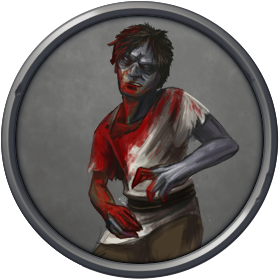
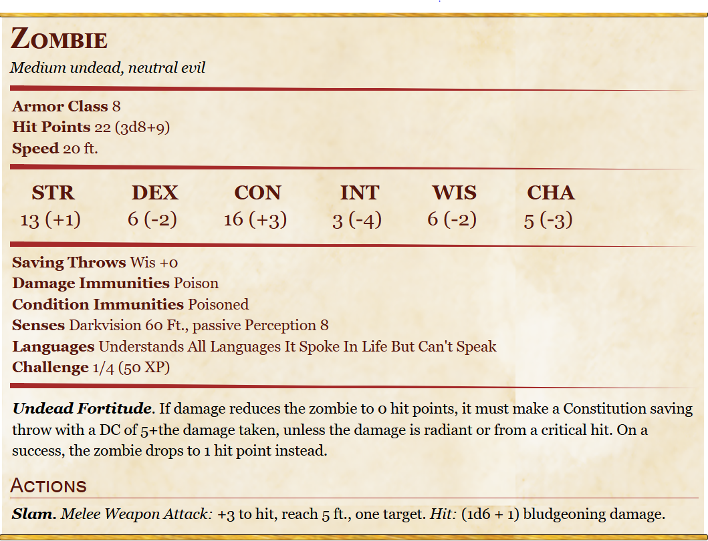

# Zombie

Medium undead, Neutral Evil

## Stats
- Armor Class: 8 
- Hit Points: 22 (3d8+9)
- Speed: 20 ft.

- STR 13 (+1) 
- DEX 06 (-2) 
- CON 16 (+3) 
- INT 03 (-4) 
- WIS 06 (-2)
- CHA 05 (-3)

## Skills 

- passive Perception 8
- Saving Throws Wis +0
- Darkvision 60 Ft.
- Challenge 1/4 (50 XP)

- Undead Fortitude: If damage reduces the zombie to 0 hit points, it must make a Constitution saving throw with a DC of 5+the damage taken, unless the damage is radiant or from a critical hit. On a success, the zombie drops to 1 hit point instead.

### Immunities:
- Poisoned
- Poison

## Actions
- Slam. Melee Weapon Attack: +3 to hit, reach 5 ft., one target. Hit: (1d6 + 1) bludgeoning damage.

## Mentions
[Salsvault](../Locations/Salsvault.md) (S6)