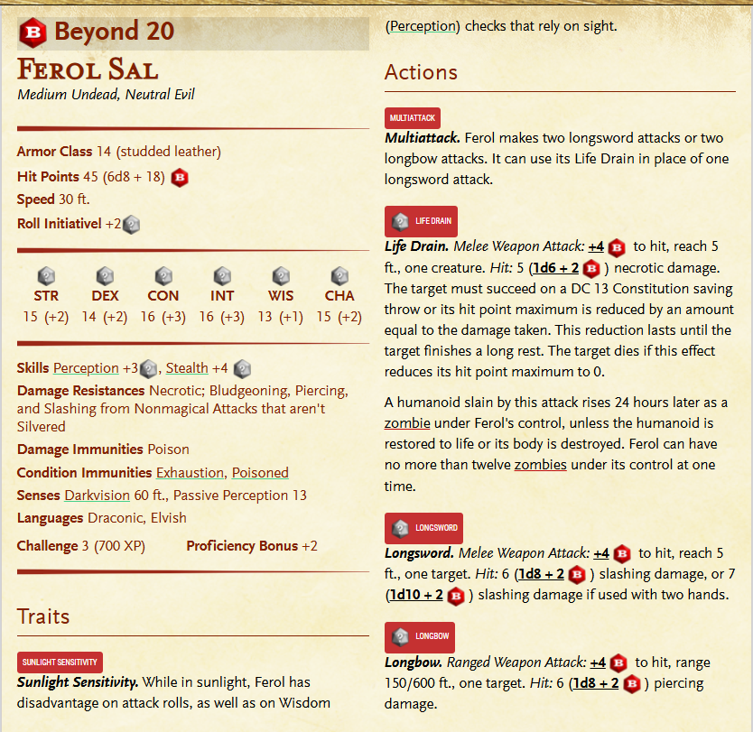

# Ferol Sal

## About
The undead Ferol Sal has worked tirelessly in the [laboratory (S17)](../Locations/Salsvault.md) for centuries, obsessed with crafting a disease that can kill the gods. Despite having made no progress in all that time, he keeps working. 
Ferol is a wight with an Intelligence of 16 (+3).

## Roleplaying Ferol
Ferol knows nothing of Exandria’s history since Aeor’s crash, and his memory of the distant past is almost as hazy. His transformation into a wight and the centuries of solitude since have driven him quite mad. He cares only about taking revenge on the gods—who he incorrectly assumes are still active in Exandria. As a resident of Aeor, Ferol doesn’t speak Common, though he can communicate in the archaic Draconic of Aeor, as well as an archaic form of Elven. Characters who speak Draconic or Elven can communicate with him, albeit slowly.

When Ferol notices the characters, he demands to know what they’re doing in Salsvault. Any character who claims they have come to help Ferol with his work and succeeds on a Charisma (Deception) check opposed by the wight’s Wisdom (Insight) check earns the undead’s trust. The check is made with advantage if characters who found and were able to read the note in area S10 mention Ferol’s plans to craft a god-killing disease.

If Ferol trusts the characters, he tells them to stay away from the locked golem lab (area S16). If they ask about the cure for [frigid woe](../Spells/Frigid-Woe.md), he tells them they can find it locked in a chest in what he calls the curative laboratory (area S18). A character who succeeds on a DC 15 Charisma (Persuasion) check can convince Ferol to provide the key that safely unlocks the chest.

If the characters don’t earn Ferol’s trust, the wight attacks, fighting until destroyed.